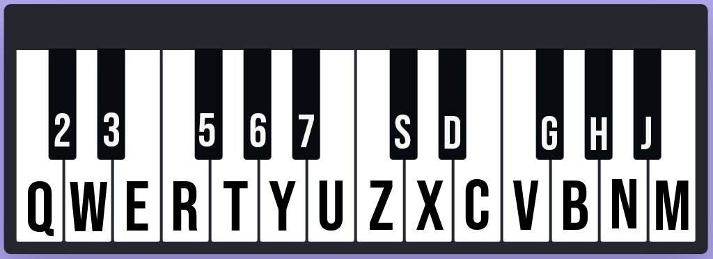

# CSS-Piano-Keys
### A vanilla playable Piano, made with HTML, CSS, JavaScript and Root Audio files.
 
The piano is mostly made and styled using CSS, and the JavaScript handles the audio files and the key behaviours.
The keys can be played by individually clicking on them, or through the keyboard.

## Key Mapping:
 

 
<a href="https://arindal1.github.io/CSS-Piano-Keys/" target="_blank">[Play Piano]</a>
